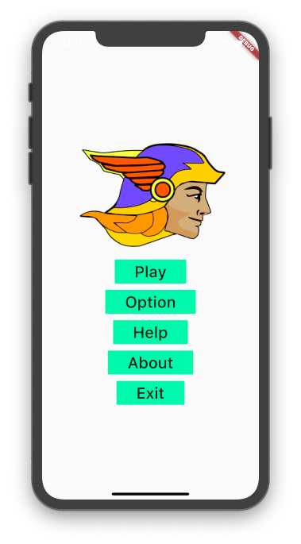
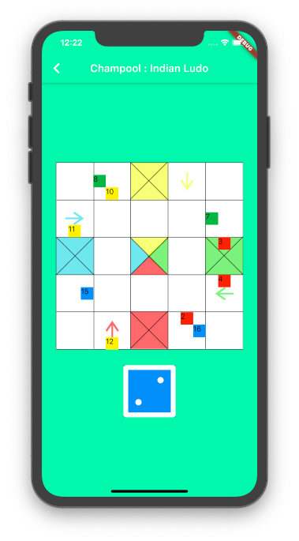
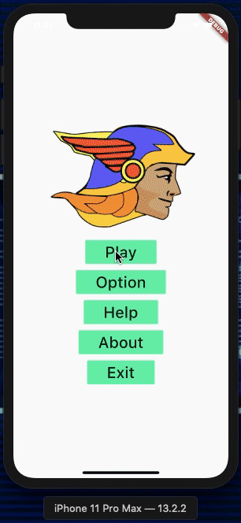

# Champool : Indian Ludo
Note : This is Flutter App. Dart languege is being used in this Project (Not JavaScript)

### Play Live : [Click Here](https://adityabirangal.github.io/champool/build/web/index.html#/)

## ScreenShots
<table style="width:100%">
  <tr>
    <th>MenuScreen</th>
    <th>PlayScreen</th>
    <th>Champool Demo</th>
  </tr>
  <tr>
    <td></td>
    <td></td>
    <td></td>
  </tr>
</table>

## Getting Started

This project is a starting point for a Flutter application.

A few resources to get you started if this is your first Flutter project:

- [Lab: Write your first Flutter app](https://flutter.dev/docs/get-started/codelab)
- [Cookbook: Useful Flutter samples](https://flutter.dev/docs/cookbook)

For help getting started with Flutter, view our
[online documentation](https://flutter.dev/docs), which offers tutorials,
samples, guidance on mobile development, and a full API reference.
